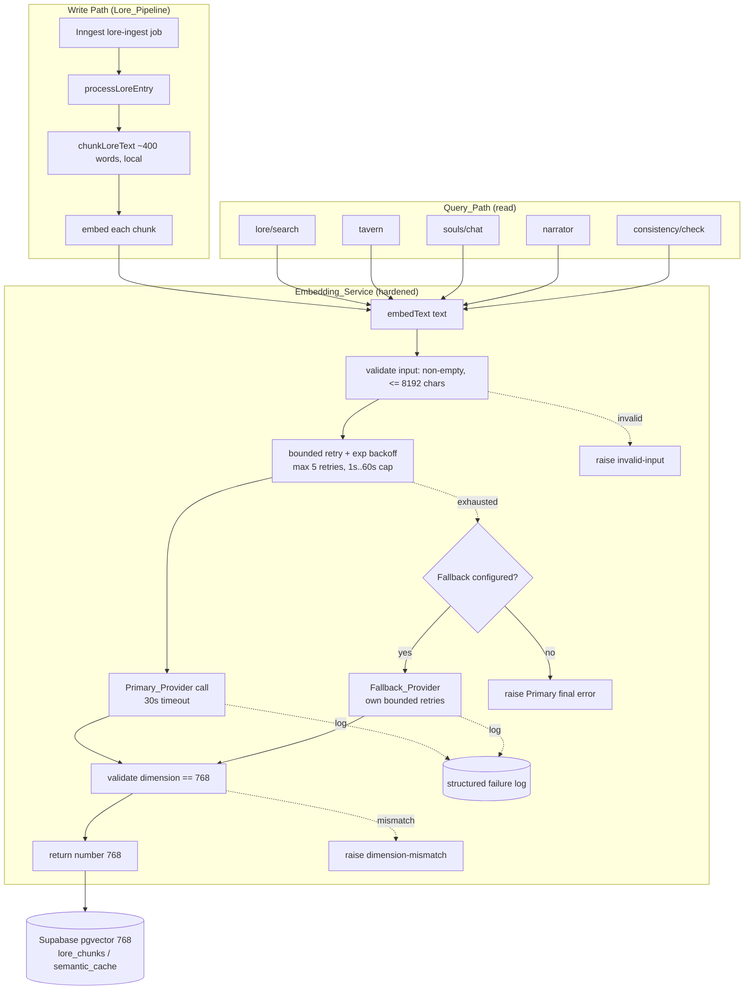
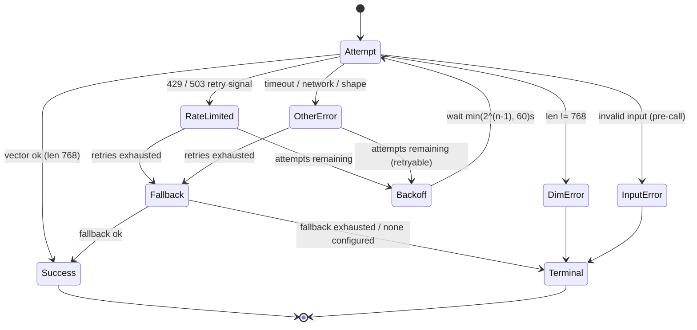

# Design Document

## Overview

This feature is a **swap-and-harden of the embedding provider** behind Grimoire's
chunk-and-store lore pipeline. Text generation already runs entirely on Groq
(`lib/groq.ts`); embeddings are the only remaining external bottleneck. Today the
embedding shim lives in `lib/gemini.ts` and calls the HuggingFace Inference API
(`featureExtraction`) with `sentence-transformers/all-mpnet-base-v2` (768-dim),
but the call path is fragile: a thin 3-attempt fixed-backoff retry sits in
`lib/lore-processing.ts`, there is no dimension validation, no input validation,
no timeout, no fallback, and no structured observability.

The goal is to let a worldbuilder on a free tier reliably chunk and store **at
least five lore entries end to end** without hitting rate or quota limits. We
achieve this by:

1. **Keeping a free, 768-dimension provider** so the existing Supabase
   `vector(768)` columns, ivfflat indexes, and RPCs (`match_lore_chunks`,
   `match_semantic_cache`) require **no migration and no re-embedding**.
2. **Hardening the `Embedding_Service`** with input validation, dimension
   validation, a 30-second per-request timeout, bounded exponential backoff
   (max 5 retries, starting at 1s, doubling, capped at 60s), an optional
   fallback provider, and structured failure logging.
3. **Preserving the `embedText(text)` contract** so all read and write call
   sites continue to work unchanged.

### Key Design Decisions

| Decision | Rationale |
| --- | --- |
| Keep `all-mpnet-base-v2` (768-dim) as Primary on HuggingFace Inference API | Already wired, free, no DB migration. Dimension is a hard DB constraint. |
| Centralize all validation/retry/backoff inside `Embedding_Service`, not in `lore-processing.ts` | Read paths (`lore/search`, `tavern`, `souls/chat`, `narrator`, `consistency/check`) get the same hardening for free. Single source of truth for retry policy. |
| Make `embedText(text): Promise<number[]>` the stable public contract | Every call site already depends on this signature; no call-site edits needed. |
| Fallback provider is **optional and config-gated** | Free-tier users with no second provider still work; operators can opt in. |
| Same provider + model for read and write | Vector similarity is only meaningful when stored and query vectors come from the same model. |
| Remove `GEMINI_API_KEY` as a hard dependency | Gemini is gone; its absence must not break initialization. |

### Correcting Stale State in the Codebase

The current code contains a misleading comment in `lib/gemini.ts` and
`lib/embeddings.ts` claiming embeddings use `BAAI/bge-base-en-v1.5`. The actual
constant is `sentence-transformers/all-mpnet-base-v2`. This design treats
`all-mpnet-base-v2` as the source of truth and removes the stale comments as part
of implementation.

## Architecture

The embedding subsystem is reorganized so that a single hardened service owns the
provider call, retry/backoff, validation, fallback, and observability. The lore
pipeline and query paths both go through the same `embedText` entry point.



### Layering

- **Config layer (`lib/env.ts` + constants)** — reads `HF_TOKEN`, optional
  fallback token/model, provider/model identifiers. Determines whether a
  Fallback_Provider is configured.
- **Provider layer** — a small `EmbeddingProvider` abstraction with one method:
  `embed(text): Promise<number[]>`. The HuggingFace provider wraps the existing
  `HfInference.featureExtraction` logic from `lib/gemini.ts`. A fallback provider
  implements the same interface.
- **Service layer (`Embedding_Service`)** — `embedText` and `getEmbeddingModel`.
  Owns validation, the retry/backoff loop, fallback orchestration, dimension
  checks, and failure logging.
- **Consumer layer** — `lib/lore-processing.ts` (write) and the five Query_Path
  routes (read). After this change, `embedWithRetry` in `lore-processing.ts`
  becomes a thin pass-through (or is removed) because retries now live in the
  service.

### Retry / Backoff State Machine



Backoff intervals follow `delay(n) = min(2^(n-1), 60)` seconds, i.e. 1, 2, 4, 8,
16, 32 (capped at 60) seconds before attempts 2 through 6. Max 5 retries means up
to 6 total invocations per provider.

## Components and Interfaces

### `Embedding_Service` (public contract — unchanged signatures)

```typescript
// lib/embeddings.ts (public surface preserved)

/**
 * Convert text into a 768-dimensional embedding vector.
 * Throws EmbeddingError on invalid input, dimension mismatch,
 * unrecognized response, or terminal provider failure.
 */
export async function embedText(text: string): Promise<number[]>;

/**
 * Returns the active embedding model identifier (provider + model),
 * used to assert read/write consistency.
 */
export function getEmbeddingModel(): string;
```

### `EmbeddingProvider` abstraction (new, internal)

```typescript
// lib/embedding/provider.ts (new)

export interface EmbeddingProvider {
  /** Stable identifier, e.g. "huggingface:sentence-transformers/all-mpnet-base-v2" */
  readonly id: string;
  /** Model identifier alone, e.g. "sentence-transformers/all-mpnet-base-v2" */
  readonly model: string;
  /** Raw embedding call. May throw provider/network errors. */
  embed(text: string, signal: AbortSignal): Promise<number[]>;
  /** Whether this provider can be reached without a token. */
  readonly allowsAnonymous: boolean;
}
```

- **HuggingFaceProvider** — wraps `HfInference.featureExtraction`, normalizing the
  `number[] | number[][]` output shape (logic ported from `lib/gemini.ts`). Uses
  `HF_TOKEN` if present; `allowsAnonymous = true`.
- **FallbackProvider** — same interface, constructed only when both fallback token
  and fallback model identifiers are present in Config.

### Service orchestration (new, internal)

```typescript
// lib/embedding/service.ts (new)

const REQUIRED_DIMENSION = 768;
const MAX_RETRIES = 5;            // 6 total attempts
const BACKOFF_START_MS = 1000;
const BACKOFF_CAP_MS = 60_000;
const REQUEST_TIMEOUT_MS = 30_000;
const MAX_INPUT_CHARS = 8192;

type FailureCategory =
  | "rate-limit"
  | "dimension-mismatch"
  | "invalid-input"
  | "unrecognized-response"
  | "other";

// Pure helpers (highly testable):
function validateInput(text: string): void;          // R2.4, R2.5, R7.5
function backoffDelayMs(attempt: number): number;    // R4.2 -> min(2^(n-1)*1000, 60000)
function classifyError(err: unknown): FailureCategory; // R8.1, R8.2
function validateDimension(vec: number[]): number[]; // R1.6, R2.2, R7.4

// Orchestration:
async function callWithRetry(provider, text): Promise<number[]>;  // R4.1-R4.5
async function embedText(text): Promise<number[]>;                // R5.1-R5.6
```

### Consumer changes

- **`lib/lore-processing.ts`** — `embedWithRetry` is reduced to a direct
  `embedText` call (the service now owns retries). The per-chunk loop is
  unchanged; on terminal failure the error propagates so the Inngest
  `onFailure` handler marks the entry `failed` and writes `failed_jobs`.
- **`lib/inngest/lore-ingest.ts`** — unchanged interface. Its existing
  `onFailure` already records `failed_jobs` and sets `processing_status` to
  `failed`, satisfying R3.4/R3.5. Per-entry isolation (R3.6) is handled by
  processing each entry as its own event/invocation.
- **Query_Path routes** — no signature changes; they call the now-hardened
  `embedText`. Each route gains a model-consistency guard via `getEmbeddingModel()`
  before issuing RPCs (R7.1, R7.2).

## Data Models

### Embedding vector

```typescript
type EmbeddingVector = number[]; // length MUST equal 768 (REQUIRED_DIMENSION)
```

Persisted into existing columns — no migration:

- `lore_chunks.embedding vector(768)` (ivfflat index, `match_lore_chunks` RPC)
- `semantic_cache.embedding vector(768)` (ivfflat index, `match_semantic_cache` RPC)

### Configuration model (`lib/env.ts` + constants)

```typescript
interface EmbeddingConfig {
  primaryProviderId: string;   // e.g. "huggingface"
  primaryModel: string;        // "sentence-transformers/all-mpnet-base-v2"
  primaryToken?: string;       // env HF_TOKEN (optional; anonymous allowed)

  // Fallback is "configured" only if BOTH are present (R6.5, R6.6)
  fallbackToken?: string;      // env EMBEDDING_FALLBACK_TOKEN
  fallbackModel?: string;      // env EMBEDDING_FALLBACK_MODEL
}
```

- `GEMINI_API_KEY` is **not** part of this model and its absence never blocks
  initialization (R6.7).
- Fallback is treated as not configured unless both `fallbackToken` and
  `fallbackModel` resolve to non-empty values (R6.6).

### Structured failure record (observability)

```typescript
interface EmbeddingFailureLog {
  providerId: string;                 // which provider was used
  category: FailureCategory;          // exactly one enum value (R8.1)
  attempt: number;                    // 1..maxAttempts (R8.1)
  chunkIndex?: number;                // zero-based, write path only (R8.3)
  message: string;                    // terminal error message (R8.3)
}

interface TerminalFailureLog {
  providersAttempted: string[];       // each provider tried (R8.4)
  totalAttempts: number;              // across all providers (R8.4)
  finalCategory: FailureCategory;
  finalMessage: string;
}
```

For the write path, the existing `failed_jobs` row (written by the Inngest
`onFailure` handler) is extended to carry `chunk_index`, `category`, and the final
`error_message` (R8.3).

### Error type

```typescript
class EmbeddingError extends Error {
  category: FailureCategory;
  actualDimension?: number;   // for dimension-mismatch (R2.2, R7.4)
  expectedDimension?: number; // always 768 when dimension-related
  providersAttempted?: string[];
}
```

## Correctness Properties

*A property is a characteristic or behavior that should hold true across all valid
executions of a system — essentially, a formal statement about what the system
should do. Properties serve as the bridge between human-readable specifications and
machine-verifiable correctness guarantees.*

The properties below are derived from the prework analysis. Redundant criteria
that asserted the same invariant (the 768-dimension rule across read/write paths,
the whitespace-rejection rule across read/write paths, and the retry
success/stop-early rule) have been consolidated so each property carries unique
validation value. EARS criteria that describe configuration presence, one-time
setup, external-service pacing, or specific state transitions are validated by
unit/integration/smoke tests in the Testing Strategy rather than as properties.

### Property 1: Valid text yields a 768-element numeric vector

*For any* text containing at least one non-whitespace character and no more than
8192 characters, when the provider returns a well-formed result, `embedText`
returns an `EmbeddingVector` of exactly 768 numeric elements.

**Validates: Requirements 1.2, 2.1, 7.3**

### Property 2: Dimension mismatch is always rejected

*For any* integer length `n != 768`, when a provider returns a vector of length
`n`, the `Embedding_Service` raises a dimension-mismatch error that names both the
actual count `n` and the expected count 768, returns no vector, persists nothing,
and (on the Query_Path) does not issue the `match_lore_chunks` or
`match_semantic_cache` RPC.

**Validates: Requirements 1.3, 1.6, 2.2, 5.2, 7.4**

### Property 3: Empty or whitespace-only input is rejected without calling the provider

*For any* string composed entirely of whitespace characters (including the empty
string), `embedText` raises an invalid-input error and never invokes any
Embedding_Provider, on both the write path and the Query_Path.

**Validates: Requirements 2.4, 7.5**

### Property 4: Over-length input is rejected without calling the provider

*For any* string longer than 8192 characters, `embedText` raises an error that
names the input length and the maximum of 8192 characters, and never invokes any
Embedding_Provider.

**Validates: Requirements 2.5**

### Property 5: Unrecognized provider responses are rejected

*For any* provider response that does not match the expected vector structure
(neither `number[]` nor `number[][]` of numbers), the `Embedding_Service` raises
an unrecognized-response error and returns no vector.

**Validates: Requirements 2.3**

### Property 6: Backoff is exponential, starts at 1s, doubles, and is capped at 60s

*For any* attempt index `n >= 1`, the backoff delay equals
`min(2^(n-1) * 1000, 60000)` milliseconds; the sequence is non-decreasing in `n`
and never exceeds 60000 ms.

**Validates: Requirements 4.2**

### Property 7: Persistent rate-limiting retries exactly five times then fails terminally

*For any* chunk whose provider always returns a Rate_Limit_Error, the
`Embedding_Service` invokes that provider exactly 6 times (initial + 5 retries),
then raises a terminal error identifying the chunk index and the final failure
reason, and produces no vector.

**Validates: Requirements 4.1, 4.3**

### Property 8: A retry that succeeds returns the vector and consumes no further attempts

*For any* `k` in `[1, 6]`, when a provider fails with a retryable error on the
first `k-1` attempts and succeeds on attempt `k`, the `Embedding_Service` invokes
the provider exactly `k` times, returns a 768-element vector, and makes no further
attempts.

**Validates: Requirements 4.4, 4.5**

### Property 9: Configured fallback serves when the primary is exhausted

*For any* request where a Fallback_Provider is configured and the Primary_Provider
fails after exhausting its bounded retries, the `Embedding_Service` invokes the
Fallback_Provider with the same input text; when the fallback returns a successful
768-element vector, that vector is returned to the caller and an observable
indication records that the Fallback_Provider (not the Primary_Provider) served
the request.

**Validates: Requirements 5.1, 5.4, 5.5**

### Property 10: Fallback configuration requires both token and model

*For any* combination of presence/absence of the fallback token and the fallback
model identifier, the Fallback_Provider is treated as configured if and only if
both values are present.

**Validates: Requirements 6.6**

### Property 11: Primary token is attached to every primary request when present

*For any* sequence of primary-provider requests (including retries) issued while a
primary access token is present in Config, every request carries that token as
authentication credentials.

**Validates: Requirements 6.2**

### Property 12: Failure classification is total and rate-limit is distinct

*For any* error raised during an embedding attempt, the recorded failure category
is exactly one of `{rate-limit, dimension-mismatch, invalid-input,
unrecognized-response, other}`, and the recorded attempt number is an integer in
`[1, maxAttempts]`; every Rate_Limit_Error maps to `rate-limit` and no non
rate-limit error maps to `rate-limit`.

**Validates: Requirements 8.1, 8.2**

### Property 13: Terminal failure log names every provider attempted and the total attempt count

*For any* request that exhausts all retries on the Primary_Provider and any
configured Fallback_Provider without success, the terminal failure log lists
exactly the set of providers attempted and a total attempt count equal to the sum
of attempts made across those providers.

**Validates: Requirements 8.4**

### Property 14: Model-consistency guard suppresses RPCs on mismatch

*For any* pair of (active model identifier, recorded stored model identifier), the
Query_Path proceeds to issue the similarity-search RPC if and only if the two
identifiers are equal; when they differ, the `Embedding_Service` raises an error
naming both identifiers and issues no RPC.

**Validates: Requirements 7.2**

### Property 15: Batch storage preserves total chunk count

*For any* batch of five or more Lore_Entries whose chunks all embed successfully,
the number of stored chunks equals the total number of chunks produced across all
entries, and every stored embedding has length 768.

**Validates: Requirements 3.1**

### Property 16: One failed entry does not abort the batch

*For any* batch of Lore_Entries in which a single entry fails embedding after all
retry and fallback attempts, every other entry in the batch is still processed and
its chunks stored.

**Validates: Requirements 3.6**

## Error Handling

All embedding errors surface as `EmbeddingError` carrying a `category` field, so
callers and observability share one taxonomy.

| Condition | Category | Service behavior | Pipeline behavior |
| --- | --- | --- | --- |
| Empty / whitespace-only text | `invalid-input` | Throw before any provider call (R2.4, R7.5) | Entry → `failed`, `failed_jobs` row |
| Text > 8192 chars | `invalid-input` | Throw before any provider call, name length + 8192 (R2.5) | Entry → `failed`, `failed_jobs` row |
| Provider vector length ≠ 768 | `dimension-mismatch` | Throw naming actual + 768; do not persist; suppress RPC (R1.6, R2.2, R7.4) | Entry → `failed`, `failed_jobs` row |
| Malformed response shape | `unrecognized-response` | Throw describing shape (R2.3) | Entry → `failed`, `failed_jobs` row |
| HTTP 429 / 503 retry signal | `rate-limit` | Retry up to 5× with capped exponential backoff (R4.1, R4.2) | — |
| Timeout (>30s) / network error | `other` | Treated as retryable up to the bound, then terminal (R2.6) | Entry → `failed`, `failed_jobs` row |
| Primary exhausted, fallback configured | (primary's last category) | Route to Fallback_Provider (R5.1) | — |
| Primary exhausted, no fallback | (primary's last category) | Raise primary's final error (R5.3) | Entry → `failed`, `failed_jobs` row |
| Primary + fallback both exhausted | (final category) | Raise error naming both providers + final reason (R5.6) | Entry → `failed`, `failed_jobs` row |
| Missing provider/model config | `other` (config) | Fail initialization with missing-config error (R1.8) | Init guard |
| No primary token, anonymous disallowed | `other` (config) | Raise config error before any request (R6.4) | Init guard |

Failure-isolation rules:

- **No partial persistence.** A chunk is only inserted after its embedding passes
  dimension validation; a failed chunk aborts that entry's write but never leaves
  partially-written vectors (R1.7).
- **Per-entry isolation.** Each Lore_Entry is processed independently; a terminal
  failure on one entry marks only that entry `failed` and records `failed_jobs`,
  while the batch continues (R3.4, R3.5, R3.6). This is enforced by the existing
  Inngest per-event invocation plus the `onFailure` handler.
- **`GEMINI_API_KEY` absence is never an error** (R6.7); it is removed from the
  embedding initialization path entirely.

## Testing Strategy

### Dual approach

- **Property-based tests** verify the universal properties above across many
  generated inputs.
- **Unit / integration / smoke tests** cover specific examples, configuration
  presence, state transitions, and external-service behavior that do not vary
  meaningfully with input.

### Property-based testing

PBT **is appropriate** for this feature: the service's validation, backoff
computation, retry/fallback orchestration, dimension enforcement, and failure
classification are deterministic logic with large, meaningful input spaces
(arbitrary text, arbitrary vector lengths, arbitrary failure schedules). External
HTTP calls are mocked behind the `EmbeddingProvider` interface so properties run
in-memory and cheaply.

- **Library**: `fast-check` with `vitest` (the project already uses `vitest`).
  Do not hand-roll property generation.
- **Iterations**: each property test runs a minimum of **100 iterations**
  (`fc.assert(..., { numRuns: 100 })`).
- **Tagging**: each property test is tagged with a comment referencing its design
  property, in the format:
  `// Feature: free-chunking-embedding-api, Property {number}: {property_text}`
- **One test per property**: each correctness property (1–16) is implemented by a
  single property-based test.
- **Generators**:
  - Valid text: strings of length 1–8192 with at least one non-whitespace char.
  - Whitespace-only: strings drawn from `[ \t\n\r\f\v]` plus the empty string.
  - Over-length: strings of length > 8192.
  - Vector lengths: integers `n != 768` for mismatch; exactly 768 for success.
  - Failure schedules: arrays describing which attempt each provider call
    fails/succeeds on, plus the failure kind (rate-limit vs other).
  - Fallback config: the 2×2 presence matrix of (token, model).
  - Model-id pairs: equal and unequal (active, recorded) identifiers.

### Unit / example tests

- Provider/model config presence and missing-config init error (R1.5, R1.8, R6.1, R6.5).
- Same module used by read and write paths; `getEmbeddingModel()` deterministic (R1.4, R7.1).
- Anonymous-allowed request without credentials (R6.3); anonymous-disallowed config error (R6.4).
- Success path sets `processing_status = complete` (R3.3).
- Terminal failure sets `failed` and writes `failed_jobs` with chunk index, category, message (R3.4, R3.5, R8.3).
- `GEMINI_API_KEY` absent → init + embed succeed (R6.7).
- No-fallback exhaustion raises primary final error (R5.3); both-fail raises combined error (R5.6).
- 30s timeout via fake timers → provider-failed error, no vector (R2.6).

### Integration / smoke tests

- Live (or recorded) HuggingFace call returning a real 768-dim vector — confirms
  provider selection and free-tier reachability (R1.1).
- Request pacing/concurrency configured at or below the provider's documented
  free-tier rate so request frequency alone does not trip throttling (R3.2).
- End-to-end: five Lore_Entries ingested through the Inngest job complete with
  stored chunk count equal to produced chunk count (R3.1, supports R3.3).
