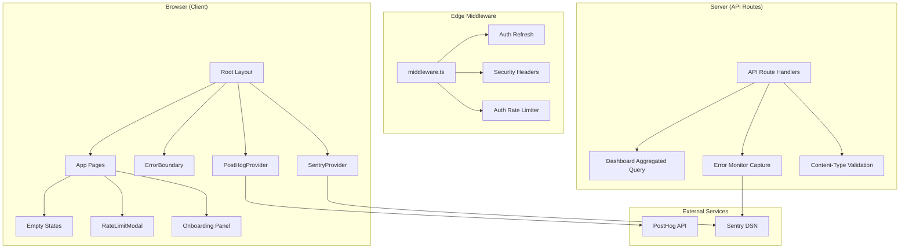
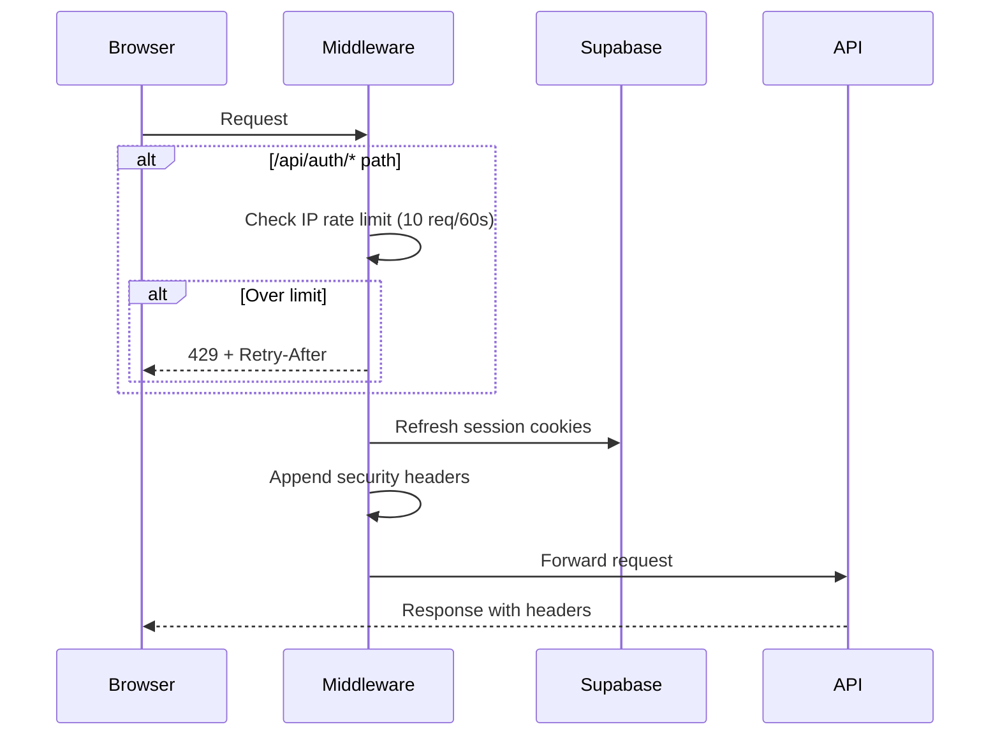

# Design Document: Production Readiness

## Overview

This design addresses 12 production-readiness requirements for Grimoire, transforming the application from a development prototype into a launch-ready SaaS product. The changes span error monitoring, product analytics, SEO, security, legal compliance, UX polish, performance optimization, and codebase hygiene.

The design leverages the existing Next.js 14 App Router architecture, Supabase backend, Zustand state management, and Radix/Tailwind UI system. Each requirement is implemented as an isolated concern with minimal coupling to reduce blast radius and enable incremental delivery.

### Key Design Decisions

1. **Sentry for error monitoring** — Industry-standard, first-class Next.js integration via `@sentry/nextjs`, automatic source map upload, and server/client separation.
2. **PostHog for analytics** — Open-source, self-hostable, first-class Next.js support, no cookie banner required when using cookieless mode.
3. **Middleware-based security headers** — Extends the existing `middleware.ts` for centralized header injection rather than `next.config.mjs` headers (more flexible for conditional logic).
4. **Supabase RPC for dashboard aggregation** — Single database function replaces N×3 per-world queries, achieving the 2 round-trip constraint.
5. **Onboarding state in `profiles` table** — Persists across sessions server-side, avoids localStorage fragility.
6. **Skip property-based testing** — This feature is primarily integration, configuration, UI rendering, and side-effect operations. Example-based unit tests and integration tests are more appropriate (see Testing Strategy).

---

## Architecture

### High-Level Integration Map



### Middleware Pipeline

The existing `middleware.ts` is extended with three concerns layered in order:

1. **Auth rate limiting** — IP-based sliding window for `/api/auth/*` routes (checked first to short-circuit abusive traffic)
2. **Supabase session refresh** — Existing auth cookie refresh logic (unchanged)
3. **Security headers** — Appended to every response before returning



---

## Components and Interfaces

### 1. Error Monitoring (`@sentry/nextjs`)

**Files:**
- `sentry.client.config.ts` — Client-side Sentry init
- `sentry.server.config.ts` — Server-side Sentry init
- `sentry.edge.config.ts` — Edge runtime Sentry init
- `next.config.mjs` — Updated with `withSentryConfig` wrapper
- `app/global-error.tsx` — Root error boundary
- `app/error.tsx` — Nested error boundary
- `lib/sentry.ts` — Utility helpers (setUser, setContext)

**Interface:**
```typescript
// lib/sentry.ts
export function initSentryUser(userId: string): void;
export function setSentryContext(route: string, worldId?: string): void;
export function captureApiError(error: unknown, request: Request): Response;
```

**Integration with API routes:**
```typescript
// Wraps existing route handlers with error capture
export function withErrorMonitoring(
  handler: (req: Request) => Promise<Response>
): (req: Request) => Promise<Response>;
```

### 2. Analytics Service (`posthog-js` / `posthog-node`)

**Files:**
- `components/providers/posthog-provider.tsx` — Client provider with lazy init
- `lib/analytics.ts` — Type-safe event tracking API
- `lib/analytics-events.ts` — Event name constants and payload types

**Interface:**
```typescript
// lib/analytics.ts
export function identifyUser(userId: string, properties: { plan: PlanTier }): void;
export function trackSectionViewed(section: WorldSection, worldId: string): void;
export function trackCoreAction(action: CoreAction, worldId: string): void;
export function trackRateLimitHit(action: string, limit: number, consumed: number): void;

type CoreAction = 
  | "lore_inscribed"
  | "soul_forged"
  | "consistency_check_run"
  | "tavern_session_created"
  | "narrator_tool_used";
```

**Failure handling:** All analytics calls are wrapped in try-catch with silent failure. The PostHog provider initializes lazily after hydration with a 3-second max wait.

### 3. SEO & Open Graph

**Files:**
- `app/page.tsx` — Updated with exported `metadata` object
- `app/demo/page.tsx` — Demo-specific metadata
- `app/robots.ts` — Next.js robots.txt generator
- `app/sitemap.ts` — Next.js sitemap generator
- `public/og-image.png` — Landing page OG image (1200×630)
- `public/og-demo.png` — Demo page OG image (1200×630)

**Metadata pattern (Next.js App Router convention):**
```typescript
// app/page.tsx
export const metadata: Metadata = {
  title: "Grimoire — Worldbuilding Studio",
  description: "...", // 50-160 chars
  alternates: { canonical: "https://grimoire.app" },
  openGraph: { /* ... */ },
  twitter: { /* ... */ },
  other: { /* JSON-LD script injection */ },
};
```

### 4. Security Hardening

**Files:**
- `middleware.ts` — Extended with security headers + auth rate limiting
- `lib/middleware/security-headers.ts` — Header constants
- `lib/middleware/auth-rate-limit.ts` — IP-based sliding window using in-memory Map with TTL cleanup
- `lib/middleware/content-type-guard.ts` — Content-Type validation utility

**Auth Rate Limiter (in-memory, edge-compatible):**
```typescript
// lib/middleware/auth-rate-limit.ts
interface RateLimitEntry {
  timestamps: number[]; // sliding window of request timestamps
}

const store = new Map<string, RateLimitEntry>();

export function checkAuthRateLimit(ip: string): {
  allowed: boolean;
  retryAfter?: number;
};
```

**Content-Type validation middleware (applied per-route):**
```typescript
// lib/middleware/content-type-guard.ts
export function validateContentType(request: Request): Response | null;
// Returns 415 Response if invalid, null if valid
```

**Excluded routes** (multipart): `/api/worlds/[id]/import`

### 5. Legal Pages

**Files:**
- `app/terms/page.tsx` — Terms of Service (static MDX or JSX)
- `app/privacy/page.tsx` — Privacy Policy (static MDX or JSX)
- Updates to `components/landing/landing-page.tsx` — Footer links
- Updates to `app/(auth)/signup/page.tsx` — Legal notice below submit

**Design:** Static pages using the existing layout/design system. Content structured with `<article>` semantics, numbered sections, and a last-updated date in a consistent format.

### 6. Custom Error Pages

**Files:**
- `app/not-found.tsx` — Custom 404 page
- `app/error.tsx` — Client error boundary (nested)
- `app/global-error.tsx` — Root error boundary (catches layout errors)

**404 Page logic:**
```typescript
// app/not-found.tsx
export default function NotFound() {
  // Check if user is authenticated (via cookie presence, client-side)
  // Show link to /dashboard if authenticated, / if not
}
```

**Error Page retry safety:**
The `error.tsx` component tracks reset attempts. After one failed reset, it stops calling `reset()` and shows a static "return to dashboard" link instead, preventing infinite loops.

### 7. Dashboard Query Performance

**Current problem:** The dashboard route iterates over all world IDs and issues 3 count queries per world in a loop (`for...of` with `await Promise.all`), causing N×3 sequential round-trips for N worlds.

**Solution:** A single Supabase RPC function that returns per-world stats in one call.

**New database function:**
```sql
-- supabase/migrations/XXXX_dashboard_stats.sql
CREATE OR REPLACE FUNCTION get_dashboard_stats(p_world_ids uuid[])
RETURNS TABLE (
  world_id uuid,
  lore_count bigint,
  soul_count bigint,
  entity_count bigint
) AS $$
BEGIN
  RETURN QUERY
  SELECT 
    w.id AS world_id,
    COALESCE(l.cnt, 0) AS lore_count,
    COALESCE(s.cnt, 0) AS soul_count,
    COALESCE(e.cnt, 0) AS entity_count
  FROM unnest(p_world_ids) AS w(id)
  LEFT JOIN (
    SELECT le.world_id, COUNT(*) AS cnt FROM lore_entries le
    WHERE le.world_id = ANY(p_world_ids) GROUP BY le.world_id
  ) l ON l.world_id = w.id
  LEFT JOIN (
    SELECT so.world_id, COUNT(*) AS cnt FROM souls so
    WHERE so.world_id = ANY(p_world_ids) GROUP BY so.world_id
  ) s ON s.world_id = w.id
  LEFT JOIN (
    SELECT en.world_id, COUNT(*) AS cnt FROM entities en
    WHERE en.world_id = ANY(p_world_ids) GROUP BY en.world_id
  ) e ON e.world_id = w.id;
END;
$$ LANGUAGE plpgsql STABLE;
```

**Refactored API route (2 round-trips):**
```
Round-trip 1 (Promise.all): worlds + profile + memberships
Round-trip 2 (Promise.all): get_dashboard_stats(allWorldIds) + recent activity
```

### 8. Rate Limit UX

**Files:**
- `components/shared/rate-limit-warning.tsx` — Inline "X left today" badge
- `components/shared/rate-limit-modal.tsx` — Full modal (extends existing `limitModal` in store)
- `lib/hooks/use-rate-limit-status.ts` — Hook to fetch current usage counts
- Updates to workspace action buttons — Disable + tooltip when exhausted

**Store extension (existing `useWorkspaceStore`):**
```typescript
// Additional fields
rateLimits: Record<string, { count: number; limit: number }>;
setRateLimits: (limits: Record<string, { count: number; limit: number }>) => void;
```

**80% threshold logic:**
```typescript
function isNearLimit(count: number, limit: number): boolean {
  return count >= Math.ceil(limit * 0.8);
}
function remainingUses(count: number, limit: number): number {
  return Math.max(0, limit - count);
}
```

**UTC midnight reset:** A `setInterval` in the workspace layout checks if the current time has crossed UTC midnight and refetches rate limits when it does (60-second polling interval).

### 9. Onboarding Flow

**Files:**
- `components/shared/onboarding-panel.tsx` — Persistent guide panel UI
- `lib/hooks/use-onboarding.ts` — Hook managing step state + persistence
- `lib/onboarding-steps.ts` — Step definitions and completion conditions
- Database: `profiles` table extended with `onboarding_state` JSONB column

**Onboarding state schema:**
```typescript
interface OnboardingState {
  currentStep: number; // 0-3
  completedSteps: boolean[]; // [false, false, false, false]
  dismissed: boolean;
  finished: boolean;
}
```

**Step definitions:**
```typescript
const ONBOARDING_STEPS = [
  { id: "write-lore", title: "Inscribe Your First Lore", section: "lore" },
  { id: "view-entity", title: "Discover Extracted Entities", section: "bible" },
  { id: "forge-soul", title: "Forge a Soul", section: "souls" },
  { id: "chat-soul", title: "Speak with Your Creation", section: "souls" },
] as const;
```

**Completion detection:** Each step's completion is detected by listening to API response success:
1. Lore entry POST returns 200/201
2. User navigates to archive AND entities exist (polled)
3. Soul POST returns 200/201
4. Chat message POST returns a response

### 10. Section Empty States

**Files:**
- `components/shared/empty-state.tsx` — Reusable empty state component
- Per-section integration in existing section components

**Component interface:**
```typescript
interface EmptyStateProps {
  icon: React.ReactNode;
  heading: string;
  description: string; // max 280 chars
  ctaLabel: string;
  ctaAction: () => void; // typically setSection() or router.push()
}
```

**Empty conditions per section:**
| Section | Condition | CTA Target |
|---------|-----------|------------|
| Lore Scribe | `loreEntries.length === 0` | Lore creation view |
| The Archive | `entities.length === 0` | Lore Scribe section |
| Bound Souls (has entities) | `souls.length === 0 && entities.length > 0` | The Archive |
| Bound Souls (no entities) | `souls.length === 0 && entities.length === 0` | Lore Scribe |
| The Tavern | `souls.length < 2` | Bound Souls |
| Narrator's Eye | `loreEntries.length === 0` | Lore Scribe |

### 11. Dead Code Removal

**Scope:** Remove `@anthropic-ai/sdk` from `package.json` dependencies.

**Verification steps:**
1. Remove from `package.json`
2. Run `npm install` to regenerate lock file
3. Grep source files for any import/reference
4. Run `npm run build` — must exit 0
5. Run `npm test` — must exit 0

### 12. Favicon & PWA Manifest

**Files:**
- `public/favicon-16x16.png`
- `public/favicon-32x32.png`
- `public/apple-touch-icon.png` (180×180)
- `public/icon-192x192.png`
- `public/icon-512x512.png`
- `public/site.webmanifest`
- `app/layout.tsx` — Updated `<head>` with icon/manifest links + theme-color meta

**Manifest content:**
```json
{
  "name": "Grimoire — Worldbuilding Studio",
  "short_name": "Grimoire",
  "theme_color": "#0A0A0B",
  "background_color": "#0A0A0B",
  "display": "standalone",
  "start_url": "/",
  "icons": [
    { "src": "/icon-192x192.png", "sizes": "192x192", "type": "image/png" },
    { "src": "/icon-512x512.png", "sizes": "512x512", "type": "image/png" }
  ]
}
```

---

## Data Models

### Extended `profiles` Table

```sql
ALTER TABLE profiles ADD COLUMN IF NOT EXISTS onboarding_state jsonb
  DEFAULT '{"currentStep": 0, "completedSteps": [false, false, false, false], "dismissed": false, "finished": false}';
```

### New `auth_rate_limits` In-Memory Store (Edge)

For the auth endpoint rate limiter running in Edge middleware, an in-memory Map is used (no database round-trip). This is acceptable because:
- Vercel edge functions share memory within a single isolate for ~5 minutes
- The 10 req/60s window is generous enough that occasional resets on cold starts are acceptable
- Production can upgrade to Vercel KV or Upstash Redis if distributed rate limiting is needed

```typescript
// In-memory structure
Map<string, number[]> // IP -> array of timestamps within window
```

### Dashboard Stats RPC

Input: `uuid[]` (world IDs)
Output: `TABLE(world_id uuid, lore_count bigint, soul_count bigint, entity_count bigint)`

### Analytics Events Schema (PostHog)

| Event Name | Properties |
|------------|-----------|
| `section_viewed` | `{ section: string, world_id: string }` |
| `lore_inscribed` | `{ world_id: string }` |
| `soul_forged` | `{ world_id: string }` |
| `consistency_check_run` | `{ world_id: string }` |
| `tavern_session_created` | `{ world_id: string }` |
| `narrator_tool_used` | `{ world_id: string }` |
| `rate_limit_hit` | `{ action: string, limit: number, consumed: number }` |

---

## Error Handling

### Error Monitoring (Sentry)

- **Client errors:** Caught by React error boundary → reported to Sentry with user ID + route context → fallback UI displayed
- **Server errors:** Caught by `withErrorMonitoring` wrapper → reported to Sentry → 500 JSON response returned (no stack trace exposure)
- **Edge errors:** Sentry edge SDK captures middleware failures

### Analytics Failures

- PostHog initialization failures are caught silently
- Individual event tracking failures are caught in try-catch with `console.warn` in development only
- The application NEVER shows analytics errors to users
- Timeout: PostHog batch sends within 30s; if offline, events are queued in memory and flushed on reconnect

### API Route Error Response Format

```typescript
// Successful error capture returns:
{ error: "An unexpected error occurred. Please try again." }
// Status: 500

// Rate limit returns:
{ error: "Rate limit exceeded. Please wait before trying again." }
// Status: 429, Headers: { "Retry-After": "42" }

// Content-Type rejection:
{ error: "Content-Type must be application/json" }
// Status: 415
```

### Dashboard Timeout

- Server-side data fetching has a 5-second timeout via `AbortController`
- On timeout, returns `{ error: "Dashboard data could not be loaded. Please refresh." }` with status 504
- Client shows an error state with retry button (not an infinite spinner)

### Onboarding Edge Cases

- If entity extraction is in progress (step 2), show a polling state with "Extracting entities..." message
- Poll every 3 seconds for up to 60 seconds before showing a "taking longer than expected" message
- Onboarding state persists to DB on every step change; localStorage is NOT used for this

---

## Testing Strategy

### Why Property-Based Testing Is Not Applicable

This feature is primarily composed of:
- **External service integrations** (Sentry, PostHog) — side-effect operations testing third-party behavior
- **Configuration and static content** (security headers, SEO meta, legal pages, manifest) — deterministic, no meaningful input variation
- **UI rendering** (error pages, empty states, onboarding panel) — visual output, snapshot-testable
- **Database query optimization** (dashboard RPC) — integration test against real/mock database
- **Build tooling** (dead code removal) — single verification, not input-dependent

None of these categories benefit from running 100+ randomized iterations. Example-based unit tests and integration tests provide better coverage for this feature.

### Unit Tests (Vitest)

| Area | Test Focus |
|------|-----------|
| `lib/middleware/auth-rate-limit.ts` | Sliding window logic: allows under limit, rejects over limit, calculates correct Retry-After, cleans expired entries |
| `lib/middleware/content-type-guard.ts` | Accepts `application/json`, rejects `text/plain`, allows multipart on excluded routes |
| `lib/middleware/security-headers.ts` | All required headers present on response |
| `lib/analytics.ts` | Event functions call PostHog with correct shape; silent failure on error |
| `lib/hooks/use-rate-limit-status.ts` | 80% threshold calculation, remaining uses math |
| `lib/onboarding-steps.ts` | Step progression logic, completion detection, dismiss/resume |
| `components/shared/empty-state.tsx` | Renders correct content per section condition |
| `components/shared/rate-limit-warning.tsx` | Shows warning at 80%, hides below |
| `app/not-found.tsx` | Renders correct link based on auth state |
| `app/error.tsx` | Calls reset on first try, shows static link on second |

### Integration Tests (Vitest + MSW)

| Area | Test Focus |
|------|-----------|
| Dashboard API route | Calls RPC with correct world IDs, completes in ≤2 await boundaries |
| Auth rate limit middleware | Full request cycle with mock IP tracking |
| SEO metadata | Landing page metadata object has all required fields |
| robots.txt / sitemap.xml | Correct allow/disallow rules, correct URLs |

### Manual/Visual Testing

| Area | Verification |
|------|-------------|
| Error pages | Visual match to design system, navigation works |
| Onboarding flow | End-to-end 4-step walkthrough |
| PWA installability | Chrome DevTools Application panel confirms installable |
| OG image previews | Facebook/Twitter card validators show correct preview |
| Legal pages | Content renders with correct structure and styling |

### Test Configuration

- **Framework:** Vitest (already configured)
- **Mocking:** MSW for API route integration tests
- **Coverage:** Focus on logic-heavy modules (rate limit, onboarding state, analytics wrapper)
- **CI:** All tests run via `npm test` (Vitest run mode)
