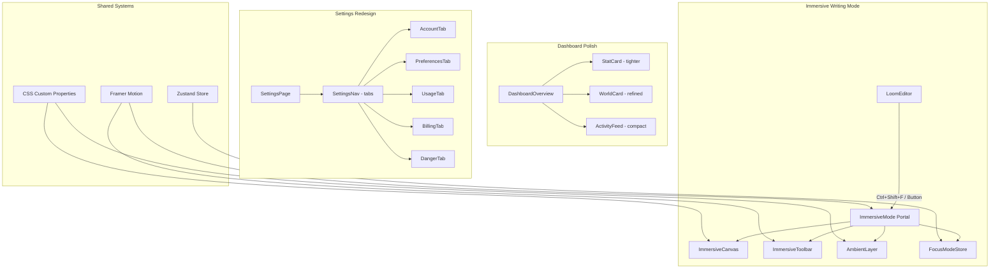
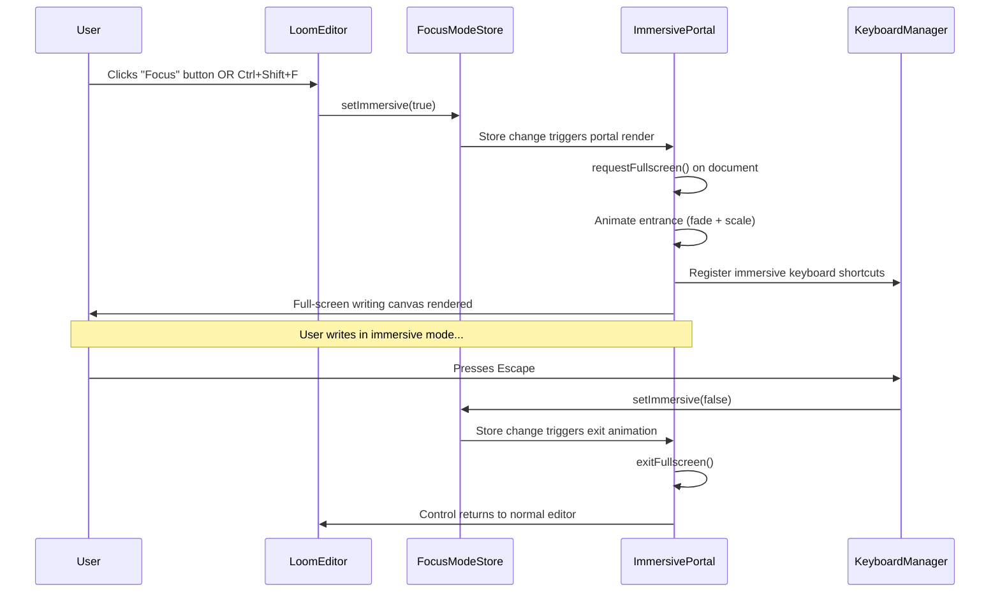
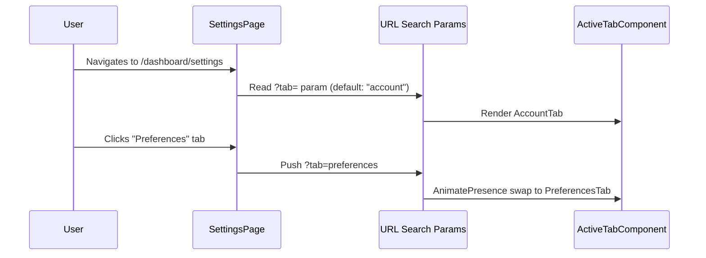

# Design Document: UI Polish & Immersive Writing Experience

## Overview

This design covers three interconnected improvements to the Grimoire worldbuilding studio: minimal dashboard polish, a complete settings page redesign, and a fully immersive full-screen writing mode for the lore editor. The central feature is the immersive writing experience — a distraction-free, atmospheric, full-screen mode that transforms the existing `LoomEditor` into a focused creative environment inspired by iA Writer's zen mode, Notion's focus mode, and Bear's minimal aesthetic, but wrapped in Grimoire's dark fantasy atmosphere.

The design philosophy is "theatrical minimalism" — the UI should disappear when the writer is in flow, revealing only atmosphere and the written word. Chrome fades away, the viewport becomes a dark stage, and the writer's text becomes the performance.

The dashboard improvements are surgical: fix visual density issues in the stats grid, improve the world card hover states, and tighten the activity feed's spacing. The settings redesign transforms the current flat card layout into a tabbed navigation system with proper sections for Account, Preferences, Usage, and Billing.

## Architecture



## Sequence Diagrams

### Immersive Mode Entry/Exit Flow



### Settings Page Tab Navigation



## Components and Interfaces

### Component 1: ImmersivePortal

**Purpose**: Full-screen overlay that renders the writing canvas in a distraction-free environment, detached from the normal DOM hierarchy via a React portal.

```typescript
interface ImmersivePortalProps {
  editor: Editor | null;
  title: string;
  onTitleChange: (title: string) => void;
  wordCount: number;
  onSave: () => void;
  onExit: () => void;
  isProcessing: boolean;
  isReadonly?: boolean;
}
```

**Responsibilities**:
- Render as a portal to `document.body`
- Manage fullscreen API lifecycle
- Provide ambient atmospheric background
- Handle keyboard shortcuts (Escape to exit, Ctrl+S to save)
- Display minimal floating toolbar on hover/activity
- Show word count and save status

### Component 2: ImmersiveToolbar

**Purpose**: A minimal, auto-hiding toolbar that appears at the bottom of the immersive canvas when the user moves their mouse or pauses typing.

```typescript
interface ImmersiveToolbarProps {
  editor: Editor | null;
  wordCount: number;
  onSave: () => void;
  onExit: () => void;
  isProcessing: boolean;
  isSaved: boolean;
  onOracleWhisper: () => void;
  oracleWhispering: boolean;
}
```

**Responsibilities**:
- Auto-hide after 3 seconds of inactivity
- Show on mouse movement or keyboard pause
- Provide formatting controls (bold, italic, heading, quote)
- Display save status indicator
- Provide exit button

### Component 3: AmbientLayer

**Purpose**: A purely decorative layer that renders atmospheric effects behind the writing canvas — subtle particle drift, vignette, and gradient shifts.

```typescript
interface AmbientLayerProps {
  intensity: "subtle" | "medium" | "vivid";
  enabled: boolean;
}
```

**Responsibilities**:
- Render CSS-only ambient gradients (no JavaScript animation for performance)
- Apply vignette effect at viewport edges
- Provide subtle grain texture overlay
- Respond to `prefers-reduced-motion`

### Component 4: SettingsLayout (Redesigned)

**Purpose**: Tab-based settings page with URL-driven navigation and smooth transitions.

```typescript
interface SettingsLayoutProps {
  user: User;
  profile: Profile | null;
  usage: UsageMeter[];
}

type SettingsTab = "account" | "preferences" | "usage" | "billing" | "danger";
```

**Responsibilities**:
- Render vertical tab navigation on desktop, horizontal on mobile
- Drive tab state from URL search params
- Animate tab content transitions
- Maintain consistent page header

### Component 5: FocusModeStore (Zustand slice)

**Purpose**: Global state for immersive writing mode, persisted to localStorage for user preference memory.

```typescript
interface FocusModeState {
  isImmersive: boolean;
  ambientIntensity: "subtle" | "medium" | "vivid";
  showParagraphFocus: boolean;
  typewriterScrolling: boolean;
  toolbarAutoHide: boolean;
  soundscape: "none" | "rain" | "fireplace" | "quill";
  
  setImmersive: (value: boolean) => void;
  setAmbientIntensity: (value: "subtle" | "medium" | "vivid") => void;
  toggleParagraphFocus: () => void;
  toggleTypewriterScrolling: () => void;
  setSoundscape: (value: FocusModeState["soundscape"]) => void;
}
```

## Data Models

### FocusModePreferences (persisted to localStorage)

```typescript
interface FocusModePreferences {
  ambientIntensity: "subtle" | "medium" | "vivid";
  showParagraphFocus: boolean;
  typewriterScrolling: boolean;
  toolbarAutoHide: boolean;
  soundscape: "none" | "rain" | "fireplace" | "quill";
  lastUsed: number; // timestamp
}
```

**Validation Rules**:
- `ambientIntensity` must be one of the three enum values
- `soundscape` must be one of the four enum values
- `lastUsed` must be a valid Unix timestamp

### SettingsTab Navigation Model

```typescript
interface SettingsTabConfig {
  id: SettingsTab;
  label: string;
  icon: LucideIcon;
  description: string;
}

const SETTINGS_TABS: SettingsTabConfig[] = [
  { id: "account", label: "Account", icon: User, description: "Identity & credentials" },
  { id: "preferences", label: "Preferences", icon: Palette, description: "Theme, sounds, writing" },
  { id: "usage", label: "Usage", icon: Gauge, description: "Daily ink & limits" },
  { id: "billing", label: "Billing", icon: CreditCard, description: "Plan & upgrades" },
  { id: "danger", label: "Danger Zone", icon: ShieldAlert, description: "Destructive actions" },
];
```

## Key Functions with Formal Specifications

### Function 1: enterImmersiveMode()

```typescript
async function enterImmersiveMode(editorRef: Editor): Promise<void>
```

**Preconditions:**
- `editorRef` is non-null and mounted
- Document is not already in fullscreen mode
- User is not in readonly mode

**Postconditions:**
- Document enters fullscreen mode (or gracefully degrades to CSS fullscreen)
- FocusModeStore `isImmersive` is set to `true`
- ImmersivePortal is rendered and visible
- Editor focus is preserved (cursor position maintained)
- All keyboard shortcuts are re-bound to immersive context

**Loop Invariants:** N/A

### Function 2: exitImmersiveMode()

```typescript
function exitImmersiveMode(): void
```

**Preconditions:**
- `isImmersive` is currently `true` in FocusModeStore

**Postconditions:**
- Exit animation completes (300ms fade-out)
- Document exits fullscreen
- FocusModeStore `isImmersive` is `false`
- Editor content is unchanged
- Focus returns to normal LoomEditor canvas
- No unsaved changes are lost

### Function 3: useToolbarVisibility()

```typescript
function useToolbarVisibility(timeoutMs: number): {
  isVisible: boolean;
  resetTimer: () => void;
}
```

**Preconditions:**
- `timeoutMs` is a positive integer (recommended: 3000)
- Component is mounted

**Postconditions:**
- Returns `isVisible: true` when mouse moves or key is pressed
- After `timeoutMs` of inactivity, `isVisible` transitions to `false`
- `resetTimer` manually forces visibility and restarts countdown
- Cleanup removes all event listeners on unmount

### Function 4: useFullscreen()

```typescript
function useFullscreen(): {
  isFullscreen: boolean;
  enter: () => Promise<void>;
  exit: () => Promise<void>;
  toggle: () => Promise<void>;
}
```

**Preconditions:**
- Browser supports Fullscreen API (graceful fallback if not)

**Postconditions:**
- `isFullscreen` reflects actual document fullscreen state
- `enter()` calls `document.documentElement.requestFullscreen()`
- `exit()` calls `document.exitFullscreen()`
- Listens to `fullscreenchange` events to sync state
- Falls back to CSS-only fullscreen (fixed positioning) on unsupported browsers

## Algorithmic Pseudocode

### Toolbar Auto-Hide Algorithm

```typescript
// Hook: useToolbarVisibility
function useToolbarVisibility(timeoutMs = 3000) {
  const [isVisible, setIsVisible] = useState(true);
  const timerRef = useRef<NodeJS.Timeout | null>(null);
  
  const resetTimer = useCallback(() => {
    setIsVisible(true);
    if (timerRef.current) clearTimeout(timerRef.current);
    timerRef.current = setTimeout(() => setIsVisible(false), timeoutMs);
  }, [timeoutMs]);
  
  useEffect(() => {
    const onActivity = () => resetTimer();
    
    window.addEventListener("mousemove", onActivity, { passive: true });
    window.addEventListener("keydown", onActivity, { passive: true });
    
    // Initial timer
    resetTimer();
    
    return () => {
      window.removeEventListener("mousemove", onActivity);
      window.removeEventListener("keydown", onActivity);
      if (timerRef.current) clearTimeout(timerRef.current);
    };
  }, [resetTimer]);
  
  return { isVisible, resetTimer };
}
```

### Paragraph Focus Highlight Algorithm

```typescript
// Highlights the current paragraph and dims all others
function useParagraphFocus(editor: Editor | null, enabled: boolean) {
  useEffect(() => {
    if (!editor || !enabled) return;
    
    const updateFocus = () => {
      const { from } = editor.state.selection;
      const resolved = editor.state.doc.resolve(from);
      
      // Find the depth-1 node (paragraph level)
      const paragraphPos = resolved.before(1);
      
      // Apply decorations: dim all paragraphs except active
      // Uses TipTap's decoration system
      editor.view.dom.querySelectorAll(".ProseMirror > *").forEach((el, i) => {
        const node = el as HTMLElement;
        if (editor.state.doc.child(i).type.name !== "paragraph") return;
        
        const isActive = /* position matches */ true;
        node.style.opacity = isActive ? "1" : "0.35";
        node.style.transition = "opacity 300ms ease";
      });
    };
    
    editor.on("selectionUpdate", updateFocus);
    return () => editor.off("selectionUpdate", updateFocus);
  }, [editor, enabled]);
}
```

### Immersive Mode Keyboard Manager

```typescript
function useImmersiveKeyboard(props: {
  isImmersive: boolean;
  onExit: () => void;
  onSave: () => void;
}) {
  useEffect(() => {
    if (!props.isImmersive) return;
    
    const handler = (e: KeyboardEvent) => {
      // Escape → exit immersive mode
      if (e.key === "Escape") {
        e.preventDefault();
        props.onExit();
        return;
      }
      
      // Ctrl/Cmd + S → save
      if ((e.ctrlKey || e.metaKey) && e.key === "s") {
        e.preventDefault();
        props.onSave();
        return;
      }
      
      // Ctrl/Cmd + Shift + F → exit (toggle off)
      if ((e.ctrlKey || e.metaKey) && e.shiftKey && e.key === "F") {
        e.preventDefault();
        props.onExit();
        return;
      }
    };
    
    window.addEventListener("keydown", handler);
    return () => window.removeEventListener("keydown", handler);
  }, [props.isImmersive, props.onExit, props.onSave]);
}
```

## Example Usage

```typescript
// Inside LoomEditor — adding immersive mode toggle
import { useFocusModeStore } from "@/lib/stores/focus-mode-store";
import { ImmersivePortal } from "@/components/lore/immersive-portal";

function LoomEditor({ worldId, initialEntries, isReadonly }: LoomEditorProps) {
  const { isImmersive, setImmersive } = useFocusModeStore();
  
  // ... existing editor setup ...
  
  return (
    <>
      <div className="relative flex h-full w-full overflow-hidden">
        {/* Existing Chrome bar — add Focus button */}
        <div className="flex h-11 shrink-0 items-center ...">
          <button
            onClick={() => setImmersive(true)}
            className="flex items-center gap-1.5 ..."
          >
            <Maximize2 className="h-3.5 w-3.5" />
            <span>Focus</span>
          </button>
        </div>
        
        {/* ... existing editor canvas ... */}
      </div>
      
      {/* Immersive mode portal — renders outside normal DOM */}
      {isImmersive && (
        <ImmersivePortal
          editor={editor}
          title={title}
          onTitleChange={setTitle}
          wordCount={currentWordCount}
          onSave={submit}
          onExit={() => setImmersive(false)}
          isProcessing={processing}
        />
      )}
    </>
  );
}
```

```typescript
// Settings page with tabbed navigation
"use client";

import { useSearchParams, useRouter } from "next/navigation";

function SettingsContent({ user, profile, usage }: SettingsLayoutProps) {
  const searchParams = useSearchParams();
  const router = useRouter();
  const activeTab = (searchParams.get("tab") as SettingsTab) || "account";
  
  return (
    <div className="flex gap-8">
      {/* Vertical tab nav */}
      <nav className="w-48 space-y-1">
        {SETTINGS_TABS.map((tab) => (
          <button
            key={tab.id}
            onClick={() => router.push(`?tab=${tab.id}`)}
            className={cn(
              "flex w-full items-center gap-3 rounded-xl px-3 py-2.5",
              activeTab === tab.id && "bg-[var(--surface-raised)] text-[var(--accent)]"
            )}
          >
            <tab.icon className="h-4 w-4" />
            <span>{tab.label}</span>
          </button>
        ))}
      </nav>
      
      {/* Tab content */}
      <AnimatePresence mode="wait">
        <motion.div key={activeTab} /* ... */>
          {activeTab === "account" && <AccountTab user={user} profile={profile} />}
          {activeTab === "preferences" && <PreferencesTab />}
          {activeTab === "usage" && <UsageTab usage={usage} />}
          {activeTab === "billing" && <BillingTab profile={profile} />}
          {activeTab === "danger" && <DangerTab />}
        </motion.div>
      </AnimatePresence>
    </div>
  );
}
```

## Correctness Properties

*A property is a characteristic or behavior that should hold true across all valid executions of a system — essentially, a formal statement about what the system should do. Properties serve as the bridge between human-readable specifications and machine-verifiable correctness guarantees.*

### Property 1: Immersive mode content round-trip

*For any* editor content (arbitrary rich text), entering immersive mode and then exiting immersive mode SHALL produce identical content to what was present before entering — no data loss occurs during mode transitions.

**Validates: Requirements 2.6, 3.3**

### Property 2: Immersive mode cursor preservation round-trip

*For any* cursor position and selection range within the editor, entering immersive mode and then exiting SHALL restore the cursor position and selection range to match the state before entry.

**Validates: Requirements 3.1, 3.2**

### Property 3: Toolbar visibility timeout behavior

*For any* sequence of user activity events (mouse movement or key press) followed by a period of inactivity, the ImmersiveToolbar SHALL become visible on activity and SHALL hide after exactly 3000ms of inactivity. Any intermediate activity event resets the countdown.

**Validates: Requirements 4.1, 4.2**

### Property 4: Paragraph focus dimming invariant

*For any* document with multiple paragraphs and any cursor position within one of those paragraphs, when paragraph focus is enabled, all paragraphs except the one containing the cursor SHALL have opacity 0.3, and the active paragraph SHALL have opacity 1.

**Validates: Requirements 6.1**

### Property 5: Focus mode preferences persistence round-trip

*For any* valid set of focus mode preferences, persisting them to localStorage and then restoring them on application load SHALL produce an equivalent preference object.

**Validates: Requirements 8.1, 8.2**

### Property 6: Focus mode preference validation

*For any* string value that is not a member of the valid enum set, the FocusModeStore SHALL reject it. Specifically: `ambientIntensity` must be one of "subtle", "medium", "vivid"; `soundscape` must be one of "none", "rain", "fireplace", "quill".

**Validates: Requirements 8.4, 8.5**

### Property 7: Immersive mode keyboard event isolation

*For any* set of parent event handlers registered on ancestor DOM elements, when immersive mode is active and the user presses Escape, the event SHALL NOT propagate to those parent handlers.

**Validates: Requirements 9.1**

### Property 8: Settings tab-URL bidirectional sync

*For any* valid tab identifier, clicking that tab SHALL produce a URL `?tab=` parameter matching that identifier, AND for any URL containing a valid `?tab=` parameter, the rendered tab content SHALL correspond to that parameter value.

**Validates: Requirements 12.3, 12.4**

## Error Handling

### Error Scenario 1: Fullscreen API Rejection

**Condition**: Browser denies `requestFullscreen()` (user gesture required, iframe restrictions, or API unavailable)
**Response**: Fall back to CSS-only fullscreen mode using `fixed inset-0 z-[9999]` positioning. Log warning to console.
**Recovery**: System continues in CSS fullscreen mode. User can still exit via Escape or the exit button.

### Error Scenario 2: Save Failure in Immersive Mode

**Condition**: Network error during `submit()` while in immersive mode
**Response**: Show a subtle toast notification within the immersive canvas (bottom-right). Do not exit immersive mode.
**Recovery**: Auto-save draft to localStorage via existing `useDraftStore`. User retries manually.

### Error Scenario 3: LocalStorage Quota Exceeded (Focus Preferences)

**Condition**: `localStorage.setItem()` throws `QuotaExceededError` when persisting focus mode preferences
**Response**: Use in-memory defaults only. Preferences reset each session.
**Recovery**: Silent degradation — feature works but preferences don't persist.

## Testing Strategy

### Unit Testing Approach

- Test `useToolbarVisibility` hook with fake timers: verify show/hide transitions at correct intervals
- Test `useImmersiveKeyboard` handler: verify correct keys trigger correct actions
- Test `useFocusModeStore`: verify state transitions and persistence serialization
- Test settings tab URL synchronization logic

### Property-Based Testing Approach

**Property Test Library**: fast-check

- **Toolbar timing property**: For any sequence of activity events followed by inactivity, the toolbar always becomes hidden after exactly `timeoutMs` of silence.
- **Content preservation**: For any editor content (arbitrary HTML), entering and exiting immersive mode yields identical content.
- **Tab navigation**: For any sequence of tab clicks, the rendered tab always matches the URL param.

### Integration Testing Approach

- Test full immersive mode flow: enter → type → save → exit → verify content
- Test settings tabs render correct content for each URL param value
- Test keyboard shortcut conflicts don't arise between normal and immersive modes

## Performance Considerations

### Immersive Mode

- **Ambient layer uses CSS-only animations** — no JavaScript requestAnimationFrame loops
- **Portal rendering** avoids re-rendering the parent LoomEditor tree
- **Toolbar hide/show** uses CSS `opacity` + `pointer-events` (GPU-composited, no layout thrash)
- **Paragraph focus** uses inline `style.opacity` mutations rather than class toggling (avoids style recalculation for all paragraphs)

### Dashboard Polish

- **Stat cards** use `will-change: transform` only on hover (not permanently)
- **Activity feed** is already virtualized via `max-h-[380px] overflow-y-auto`; no changes needed

### Settings

- **Tab content** uses `AnimatePresence mode="wait"` to avoid rendering multiple tabs simultaneously
- **Usage meters** render server-side; no client-side polling

## Security Considerations

- Immersive mode does not introduce any new API calls or network requests
- Fullscreen API usage is gated behind user gesture (click/keyboard) as required by browsers
- Settings page continues to use server-side session validation via `getSessionUser()`
- No new user data is exposed; focus preferences are stored locally only

## Dependencies

### Existing (no new additions)

- `framer-motion` — entrance/exit animations for immersive portal
- `zustand` + `zustand/middleware/persist` — focus mode preferences store
- `@tiptap/react` — editor instance shared between normal and immersive mode
- `lucide-react` — icons for toolbar and settings tabs
- `next/navigation` — URL-driven tab state for settings

### No New Dependencies Required

The entire feature is implementable with the existing dependency tree. CSS custom properties handle all ambient effects. The fullscreen API is native. React portals are built-in.

---

## Detailed Specifications by Feature Area

---

## 1. Immersive Writing Mode — Detailed CSS & Animation Spec

### Canvas Layout (Immersive)

```css
/* The immersive container — fills viewport, sits above everything */
.immersive-canvas {
  position: fixed;
  inset: 0;
  z-index: 9999;
  display: flex;
  flex-direction: column;
  align-items: center;
  background: var(--bg);
  overflow: hidden;
}

/* The writing column — narrow, centered, generous vertical padding */
.immersive-writing-column {
  width: 100%;
  max-width: 680px;
  padding: 12vh 2rem 30vh;
  overflow-y: auto;
  scrollbar-width: none;
}

.immersive-writing-column::-webkit-scrollbar {
  display: none;
}

/* Atmospheric vignette — darkens edges */
.immersive-vignette {
  position: fixed;
  inset: 0;
  pointer-events: none;
  background: radial-gradient(
    ellipse 70% 60% at 50% 50%,
    transparent 40%,
    color-mix(in srgb, var(--bg) 90%, black) 100%
  );
  z-index: 1;
}

/* Ambient gradients — very subtle color shifts */
.immersive-atmosphere {
  position: fixed;
  inset: 0;
  pointer-events: none;
  z-index: 0;
  background-image:
    radial-gradient(ellipse 50% 40% at 20% 80%, color-mix(in srgb, var(--accent) 4%, transparent), transparent),
    radial-gradient(ellipse 40% 30% at 80% 20%, color-mix(in srgb, var(--ai-pulse) 3%, transparent), transparent);
  animation: atmosphereShift 30s ease-in-out infinite alternate;
}

@keyframes atmosphereShift {
  0%   { opacity: 0.6; }
  50%  { opacity: 1; }
  100% { opacity: 0.7; }
}

/* Grain texture overlay */
.immersive-grain {
  position: fixed;
  inset: 0;
  pointer-events: none;
  z-index: 2;
  opacity: 0.018;
  background-image: url("data:image/svg+xml,..."); /* Same noise SVG as existing writing-paper */
  mix-blend-mode: overlay;
}
```

### Entrance/Exit Animations

```typescript
// Framer Motion variants for immersive portal
const portalVariants = {
  hidden: { 
    opacity: 0, 
    scale: 0.98,
    filter: "blur(8px)",
  },
  visible: { 
    opacity: 1, 
    scale: 1,
    filter: "blur(0px)",
    transition: { 
      duration: 0.4, 
      ease: [0.22, 1, 0.36, 1] // --ease-strong-out
    }
  },
  exit: { 
    opacity: 0, 
    scale: 1.01,
    filter: "blur(4px)",
    transition: { 
      duration: 0.25, 
      ease: [0.77, 0, 0.175, 1] // --ease-in-out-sharp
    }
  },
};

// Toolbar slide-up animation
const toolbarVariants = {
  hidden: { 
    opacity: 0, 
    y: 20,
    transition: { duration: 0.2, ease: "easeIn" }
  },
  visible: { 
    opacity: 1, 
    y: 0,
    transition: { duration: 0.3, ease: [0.22, 1, 0.36, 1] }
  },
};
```

### Paragraph Focus Effect

```css
/* Applied to TipTap editor in immersive mode when paragraph focus is enabled */
.immersive-paragraph-focus .ProseMirror > * {
  opacity: 0.3;
  transition: opacity 400ms cubic-bezier(0.22, 1, 0.36, 1);
}

.immersive-paragraph-focus .ProseMirror > *.is-active-paragraph {
  opacity: 1;
}

/* Reduced motion variant */
@media (prefers-reduced-motion: reduce) {
  .immersive-paragraph-focus .ProseMirror > * {
    transition: none;
  }
}
```

---

## 2. Dashboard Polish — Minimal Changes Spec

### Issues Identified

1. **Stat cards**: The `text-5xl` number is too large for the card height, creating cramped feel
2. **World cards**: The `h-28` header is slightly oversized for cards with no premise text
3. **Activity feed**: Date group headers have unnecessary stickiness that fights the compact layout
4. **Quick Actions**: The `arcane-border` pseudo-element adds visual noise to an already dense sidebar

### Fixes

```typescript
// StatCard: Reduce number size from text-5xl to text-4xl, add gap between sparkline and number
// Before:
<p className="font-heading text-5xl text-[var(--text-main)] tabular-nums">{count}</p>

// After:
<p className="font-heading text-4xl text-[var(--text-main)] tabular-nums">{count}</p>

// World cards: Reduce header from h-28 to h-20 when no premise
// Conditional: world.premise ? "h-28" : "h-20"

// Activity feed: Remove sticky positioning from date headers
// Before: className="sticky top-0 z-10 ..."
// After:  className="..." (remove sticky)

// Quick Actions card: Remove arcane-border class
// Before: className="glass-panel arcane-border rounded-[14px] ..."
// After:  className="glass-panel rounded-[14px] ..."
```

---

## 3. Settings Page Redesign — Component Structure

### Layout Structure

```
/dashboard/settings
├── DashboardNav (unchanged)
├── SettingsHeader (page title + back button)
├── SettingsContent (client component)
│   ├── SettingsTabNav (left sidebar on desktop, top bar on mobile)
│   └── TabContent (AnimatePresence container)
│       ├── AccountTab
│       │   ├── Avatar + display name
│       │   ├── Email (readonly)
│       │   └── Change password link
│       ├── PreferencesTab
│       │   ├── Appearance toggle (light/dark)
│       │   ├── Writing preferences
│       │   │   ├── Default ambient intensity
│       │   │   ├── Typewriter mode default
│       │   │   └── Paragraph focus default
│       │   └── Ambient audio toggle
│       ├── UsageTab
│       │   ├── Daily rate limit meters (existing)
│       │   └── Free tier caps (existing)
│       ├── BillingTab
│       │   ├── Current plan
│       │   └── Upgrade CTA
│       └── DangerTab
│           └── Delete account
```

### Tab Navigation Styling

```typescript
// Desktop: Vertical sidebar navigation
const tabNavDesktop = cn(
  "hidden lg:flex lg:w-52 lg:flex-col lg:gap-0.5",
  "rounded-[16px] border border-[var(--border)] bg-[var(--surface)] p-2"
);

// Mobile: Horizontal scrollable strip
const tabNavMobile = cn(
  "flex lg:hidden gap-1 overflow-x-auto pb-2",
  "[scrollbar-width:none] [&::-webkit-scrollbar]:hidden"
);

// Active tab button
const tabButtonActive = cn(
  "flex items-center gap-2.5 rounded-[12px] px-3 py-2.5 text-sm",
  "bg-[color-mix(in_srgb,var(--accent)_8%,transparent)]",
  "text-[var(--accent)] font-medium",
  "border border-[color-mix(in_srgb,var(--accent)_15%,transparent)]"
);

// Inactive tab button
const tabButtonInactive = cn(
  "flex items-center gap-2.5 rounded-[12px] px-3 py-2.5 text-sm",
  "text-[var(--text-muted)] hover:text-[var(--text-main)]",
  "hover:bg-[color-mix(in_srgb,var(--text-main)_4%,transparent)]",
  "transition-colors"
);
```

### Preferences Tab — Writing Preferences Section

```typescript
interface WritingPreference {
  id: string;
  label: string;
  description: string;
  type: "toggle" | "select";
  options?: { value: string; label: string }[];
}

const WRITING_PREFERENCES: WritingPreference[] = [
  {
    id: "ambientIntensity",
    label: "Ambient atmosphere",
    description: "Intensity of background effects in immersive mode",
    type: "select",
    options: [
      { value: "subtle", label: "Subtle" },
      { value: "medium", label: "Medium" },
      { value: "vivid", label: "Vivid" },
    ],
  },
  {
    id: "typewriterScrolling",
    label: "Typewriter scrolling",
    description: "Keep the active line centered in the viewport",
    type: "toggle",
  },
  {
    id: "paragraphFocus",
    label: "Paragraph focus",
    description: "Dim all paragraphs except the one you're editing",
    type: "toggle",
  },
  {
    id: "toolbarAutoHide",
    label: "Auto-hide toolbar",
    description: "Hide the formatting toolbar after 3 seconds of inactivity",
    type: "toggle",
  },
];
```
